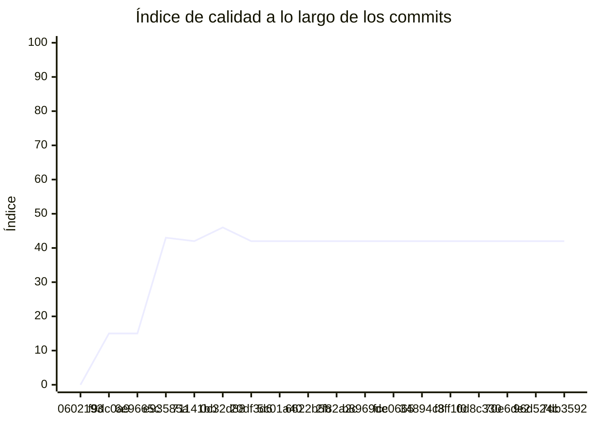

<!-- evaluacion:inicio -->
# Evaluación — Final-Programacion-II/turnos-catalog-service

> Documento **generado automáticamente** por la cátedra de Programación II (UM): RepoSense + análisis de calidad de **7 dimensiones**. **No editar a mano**: se regenera en cada evaluación.
> Rama evaluada: `main`. Análisis **heurístico** (regex + métricas) + build: es una criba para orientar la revisión, **no una nota**. La **documentación** del repositorio no se evalúa.
> Generado: 2026-11-12.

## 1. Veredicto

| Aspecto | Resultado |
|---|---|
| Índice de calidad | **53/100** |
| Tipo de repositorio | `backend` |
| Build (`mvnw verify` / `gradlew check`) | OK |
| Código (LOC) | 7,353 |
| Archivos de código | 148 |
| Clases | 154 |
| Código dentro de clases (%POO) | 80% |
| Funciones fuera de clases | 0 |
| Duplicación (puerta) | 7.8% |
| Duplicación lógica | 8.4% |
| Duplicación de boilerplate | 10.6% |
| Cobertura | 70% |

> Este informe **describe** lo que el análisis midió con los criterios ya establecidos de la materia. No es una nota.

## 2. Semáforo de aprobación

Criterios de la cátedra (`CRITERIOS-CALIDAD.md`): **Aprobar** se juega con el perfil `estandar`; **destacar**, con el `exigente` (meta de excelencia).

| Semáforo | Resultado |
|---|---|
| Aprobar (`estandar`) | **no cumple** — 3/11 |
| Destacar (`exigente`) | **no cumple** — 3/11 |

**Para aprobar, falta cumplir:** SOLID; Hexagonal; Duplicación; SQL; Cobertura

**Para destacar, falta cumplir:** SOLID; Hexagonal; Duplicación; SQL; Cobertura

## 3. Autoría (RepoSense)

| Autor | Commits | Código (LOC) | Tests (LOC) | Docs (LOC) | Días activos | % del código |
|---|---:|---:|---:|---:|---:|---:|
| Facundo Mangione | 32 | 4,707 | 4,409 | 2,111 | 22 | 100% |

> _El LOC de autoría lo calcula RepoSense sobre el historial y puede diferir del LOC de código del análisis (que mira el estado de `main`)._

## 4. Dimensiones evaluadas

Cada dimensión indica **qué mide**, **por qué importa** y **tu resultado**. Cuando el puntaje queda por debajo de la referencia, se agregan preguntas para **investigar la causa** (no hay recetas).

| Dimensión | Peso | Puntaje |
|:--|--:|--:|
| **D1** Diseño OO, SOLID y patrones (20%) | 20% | 2 |
| **D2** Arquitectura hexagonal — backend (15%) | 15% | 0 |
| **D3** Frontend KMP: MVVM y buenas prácticas (10%) | 10% | N/A |
| **D4** Integración y contrato (10%) | 10% | 90 |
| **D5** Seguridad y robustez (10%) | 10% | 70 |
| **D6** Pruebas y cobertura (20%) | 20% | 100 |
| **D7** Proceso y entrega (15%) | 15% | 77 |

### D1. Diseño OO, SOLID y patrones (20%)

- **Qué mide:** Métricas orientadas a objetos (clases, métodos, campos, cohesión, acoplamiento, herencia) y proxies de SOLID, más patrones de diseño.
- **Por qué importa:** El eje de la materia es el buen uso de la POO y su arquitectura: un diseño con clases claras y poco acopladas es más fácil de entender, probar y cambiar.
- **Tu resultado:** **2/100**
- **Para investigar la causa:**
    - ¿Se pensó el modelo de clases antes de codificar o se agrupó después?
    - ¿Qué clases concentran muchas responsabilidades a la vez?
    - ¿Los colaboradores llegan como parámetros o se crean por dentro?

### D2. Arquitectura hexagonal — backend (15%)

- **Qué mide:** Separación en capas (dominio, puertos de entrada/salida, adaptadores) y dirección de las dependencias del backend.
- **Por qué importa:** Aislar el dominio de la infraestructura permite cambiar la base de datos, el framework o el transporte sin tocar las reglas de negocio.
- **Tu resultado:** **0/100**
- **Para investigar la causa:**
    - ¿El dominio importa framework o detalles de persistencia?
    - ¿Dónde vive la lógica de negocio frente a los controladores?
    - ¿Se definieron puertos para los servicios que se consumen?

### D4. Integración y contrato (10%)

- **Qué mide:** Cumplimiento del contrato de integración de la cátedra (formato de errores, paginación, autenticación, endpoints esperados).
- **Por qué importa:** Los servicios deben poder integrarse entre sí y con la app sin sorpresas; el contrato es lo que hacen cumplir las pruebas de integración.
- **Tu resultado:** **90/100**

### D5. Seguridad y robustez (10%)

- **Qué mide:** Credenciales embebidas, consultas SQL por concatenación, y presencia de config de entorno; aislamiento de secretos.
- **Por qué importa:** Un secreto en el repositorio o una consulta construida por concatenación son riesgos concretos, no hipotéticos.
- **Tu resultado:** **70/100**

### D6. Pruebas y cobertura (20%)

- **Qué mide:** Cantidad y resultado de pruebas y cobertura de línea (JaCoCo/Kover, Surefire/Failsafe) cuando hay build.
- **Por qué importa:** Las pruebas son la red de seguridad para refactorizar e integrar; la cobertura acota las zonas sin verificar.
- **Tu resultado:** **100/100**

### D7. Proceso y entrega (15%)

- **Qué mide:** Artefactos verificables de proceso/entrega: `compose`, `.env.example`, CI (`.github/workflows/`), `CODEOWNERS` y wrapper de build (`mvnw`/`gradlew`). **No** puntúa documentación.
- **Por qué importa:** Un proyecto que compila, se levanta y se valida solo es más fácil de revisar y de integrar en equipo.
- **Tu resultado:** **77/100**

## 5. Señales detectadas

El análisis encontró las siguientes señales (archivo, sin número de línea a propósito):

**SRP/responsabilidad** (70)
- clase 'CatalogApp' grande (LOC=80, métodos=10, campos=2) — `src/main/java/ar/edu/um/turnos/catalog/CatalogApp.java`
- método 'CatalogApp.logApplicationStartup' de 35 líneas — `src/main/java/ar/edu/um/turnos/catalog/CatalogApp.java`
- clase 'RedisCatalogChangeSource' con baja cohesión (40%) — `src/main/java/ar/edu/um/turnos/catalog/sync/infrastructure/redis/RedisCatalogChangeSource.java`
- método 'CatalogSnapshotResponse.CategoryItem' con 6 parámetros — `src/main/java/ar/edu/um/turnos/catalog/sync/infrastructure/catedra/CatalogSnapshotResponse.java`
- método 'CategoryItem.CategoryItem' con 6 parámetros — `src/main/java/ar/edu/um/turnos/catalog/sync/infrastructure/catedra/CatalogSnapshotResponse.java`
- método 'CatalogSnapshot.CatalogSnapshot' de 46 líneas — `src/main/java/ar/edu/um/turnos/catalog/sync/domain/CatalogSnapshot.java`
- método 'CatalogSnapshot.CatalogSnapshot' con complejidad 7 — `src/main/java/ar/edu/um/turnos/catalog/sync/domain/CatalogSnapshot.java`
- método 'CatalogSnapshot.validateReferences' con complejidad 6 — `src/main/java/ar/edu/um/turnos/catalog/sync/domain/CatalogSnapshot.java`
- método 'CatalogSnapshot.Category' con 6 parámetros — `src/main/java/ar/edu/um/turnos/catalog/sync/domain/CatalogSnapshot.java`
- método 'Category.Category' con 6 parámetros — `src/main/java/ar/edu/um/turnos/catalog/sync/domain/CatalogSnapshot.java`
- clase 'SecurityUtils' grande (LOC=122, métodos=13, campos=2) — `src/main/java/ar/edu/um/turnos/catalog/security/SecurityUtils.java`
- método 'SecurityUtils.extractDetailsFromTokenAttributes' de 39 líneas — `src/main/java/ar/edu/um/turnos/catalog/security/SecurityUtils.java`
- método 'SecurityUtils.extractDetailsFromTokenAttributes' con complejidad 7 — `src/main/java/ar/edu/um/turnos/catalog/security/SecurityUtils.java`
- clase 'LoggingAspect' grande (LOC=89, métodos=11, campos=1) — `src/main/java/ar/edu/um/turnos/catalog/aop/logging/LoggingAspect.java`
- método 'ProfessionalAgendaService.toAgenda' de 32 líneas — `src/main/java/ar/edu/um/turnos/catalog/service/ProfessionalAgendaService.java`
- clase 'ProfessionalService' grande (LOC=136, métodos=10, campos=4) — `src/main/java/ar/edu/um/turnos/catalog/service/ProfessionalService.java`
- método 'ProfessionalService.search' con 6 parámetros — `src/main/java/ar/edu/um/turnos/catalog/service/ProfessionalService.java`
- método 'CatalogSyncStatusDTO.CatalogSyncStatusDTO' con 5 parámetros — `src/main/java/ar/edu/um/turnos/catalog/service/dto/CatalogSyncStatusDTO.java`
- clase 'ProfessionalCategoryDTO' grande (LOC=86, métodos=17, campos=7) — `src/main/java/ar/edu/um/turnos/catalog/service/dto/ProfessionalCategoryDTO.java`
- clase 'ProfessionalCategoryDTO' con baja cohesión (21%) — `src/main/java/ar/edu/um/turnos/catalog/service/dto/ProfessionalCategoryDTO.java`
- clase 'WeeklyScheduleDTO' grande (LOC=114, métodos=23, campos=10) — `src/main/java/ar/edu/um/turnos/catalog/service/dto/WeeklyScheduleDTO.java`
- clase 'WeeklyScheduleDTO' con baja cohesión (15%) — `src/main/java/ar/edu/um/turnos/catalog/service/dto/WeeklyScheduleDTO.java`
- método 'ProfessionalAgendaDTO.Schedule' con 5 parámetros — `src/main/java/ar/edu/um/turnos/catalog/service/dto/ProfessionalAgendaDTO.java`
- método 'Schedule.Schedule' con 5 parámetros — `src/main/java/ar/edu/um/turnos/catalog/service/dto/ProfessionalAgendaDTO.java`
- clase 'ProfessionalDTO' grande (LOC=95, métodos=19, campos=8) — `src/main/java/ar/edu/um/turnos/catalog/service/dto/ProfessionalDTO.java`
- clase 'ProfessionalDTO' con baja cohesión (18%) — `src/main/java/ar/edu/um/turnos/catalog/service/dto/ProfessionalDTO.java`
- clase 'SecurityMetersService' grande (LOC=35, métodos=7, campos=8) — `src/main/java/ar/edu/um/turnos/catalog/management/SecurityMetersService.java`
- clase 'SecurityMetersService' con baja cohesión (33%) — `src/main/java/ar/edu/um/turnos/catalog/management/SecurityMetersService.java`
- clase 'WeeklySchedule' grande (LOC=173, métodos=33, campos=11) — `src/main/java/ar/edu/um/turnos/catalog/domain/WeeklySchedule.java`
- clase 'WeeklySchedule' con baja cohesión (11%) — `src/main/java/ar/edu/um/turnos/catalog/domain/WeeklySchedule.java`
- clase 'AbstractAuditingEntity' con baja cohesión (14%) — `src/main/java/ar/edu/um/turnos/catalog/domain/AbstractAuditingEntity.java`
- clase 'ProfessionalCategory' grande (LOC=125, métodos=24, campos=8) — `src/main/java/ar/edu/um/turnos/catalog/domain/ProfessionalCategory.java`
- clase 'ProfessionalCategory' con baja cohesión (15%) — `src/main/java/ar/edu/um/turnos/catalog/domain/ProfessionalCategory.java`
- clase 'Professional' grande (LOC=138, métodos=27, campos=9) — `src/main/java/ar/edu/um/turnos/catalog/domain/Professional.java`
- clase 'Professional' con baja cohesión (13%) — `src/main/java/ar/edu/um/turnos/catalog/domain/Professional.java`
- clase 'CatalogSyncState' grande (LOC=71, métodos=11, campos=7) — `src/main/java/ar/edu/um/turnos/catalog/domain/CatalogSyncState.java`
- clase 'CatalogSyncState' con baja cohesión (24%) — `src/main/java/ar/edu/um/turnos/catalog/domain/CatalogSyncState.java`
- clase 'AccountResource' con baja cohesión (11%) — `src/main/java/ar/edu/um/turnos/catalog/web/rest/AccountResource.java`
- clase 'UserVM' con baja cohesión (30%) — `src/main/java/ar/edu/um/turnos/catalog/web/rest/AccountResource.java`
- clase 'ExceptionTranslator' grande (LOC=183, métodos=23, campos=7) — `src/main/java/ar/edu/um/turnos/catalog/web/rest/errors/ExceptionTranslator.java`
- clase 'ExceptionTranslator' con baja cohesión (0%) — `src/main/java/ar/edu/um/turnos/catalog/web/rest/errors/ExceptionTranslator.java`
- método 'ExceptionTranslator.customizeProblem' con complejidad 9 — `src/main/java/ar/edu/um/turnos/catalog/web/rest/errors/ExceptionTranslator.java`
- método 'ExceptionTranslator.getCustomizedErrorDetails' con complejidad 6 — `src/main/java/ar/edu/um/turnos/catalog/web/rest/errors/ExceptionTranslator.java`
- clase 'CatalogSyncIT' grande (LOC=79, métodos=5, campos=9) — `src/test/java/ar/edu/um/turnos/catalog/sync/CatalogSyncIT.java`
- clase 'CatedraRestAdapterTest' con baja cohesión (17%) — `src/test/java/ar/edu/um/turnos/catalog/sync/infrastructure/catedra/CatedraRestAdapterTest.java`
- clase 'JpaCatalogReplicaIT' grande (LOC=125, métodos=15, campos=5) — `src/test/java/ar/edu/um/turnos/catalog/sync/infrastructure/persistence/JpaCatalogReplicaIT.java`
- clase 'JpaCatalogReplicaIT' con baja cohesión (44%) — `src/test/java/ar/edu/um/turnos/catalog/sync/infrastructure/persistence/JpaCatalogReplicaIT.java`
- clase 'CatalogSyncServiceTest' grande (LOC=82, métodos=12, campos=5) — `src/test/java/ar/edu/um/turnos/catalog/sync/application/CatalogSyncServiceTest.java`
- clase 'CatalogSyncServiceTest' con baja cohesión (21%) — `src/test/java/ar/edu/um/turnos/catalog/sync/application/CatalogSyncServiceTest.java`
- clase 'ReplicaFalsa' con baja cohesión (17%) — `src/test/java/ar/edu/um/turnos/catalog/sync/application/CatalogSyncServiceTest.java`
- clase 'JwtAuthenticationTestUtils' grande (LOC=57, métodos=10, campos=1) — `src/test/java/ar/edu/um/turnos/catalog/security/jwt/JwtAuthenticationTestUtils.java`
- clase 'TokenAuthenticationSecurityMetersIT' con baja cohesión (48%) — `src/test/java/ar/edu/um/turnos/catalog/security/jwt/TokenAuthenticationSecurityMetersIT.java`
- clase 'DateTimeWrapper' grande (LOC=96, métodos=19, campos=9) — `src/test/java/ar/edu/um/turnos/catalog/repository/timezone/DateTimeWrapper.java`
- clase 'DateTimeWrapper' con baja cohesión (11%) — `src/test/java/ar/edu/um/turnos/catalog/repository/timezone/DateTimeWrapper.java`
- clase 'HibernateTimeZoneIT' grande (LOC=114, métodos=10, campos=8) — `src/test/java/ar/edu/um/turnos/catalog/config/timezone/HibernateTimeZoneIT.java`
- clase 'ProfessionalSearchIT' grande (LOC=135, métodos=16, campos=5) — `src/test/java/ar/edu/um/turnos/catalog/web/rest/ProfessionalSearchIT.java`
- método 'ProfessionalSearchIT.profesional' con 5 parámetros — `src/test/java/ar/edu/um/turnos/catalog/web/rest/ProfessionalSearchIT.java`
- método 'ProfessionalSearchIT.horario' con 6 parámetros — `src/test/java/ar/edu/um/turnos/catalog/web/rest/ProfessionalSearchIT.java`
- clase 'CatalogSyncStatusIT' con baja cohesión (27%) — `src/test/java/ar/edu/um/turnos/catalog/web/rest/CatalogSyncStatusIT.java`
- clase 'ProfessionalCategoryResourceIT' grande (LOC=138, métodos=16, campos=21) — `src/test/java/ar/edu/um/turnos/catalog/web/rest/ProfessionalCategoryResourceIT.java`
- clase 'ProfessionalCategoryResourceIT' con baja cohesión (19%) — `src/test/java/ar/edu/um/turnos/catalog/web/rest/ProfessionalCategoryResourceIT.java`
- clase 'ProfessionalResourceIT' grande (LOC=170, métodos=19, campos=23) — `src/test/java/ar/edu/um/turnos/catalog/web/rest/ProfessionalResourceIT.java`
- clase 'ProfessionalResourceIT' con baja cohesión (26%) — `src/test/java/ar/edu/um/turnos/catalog/web/rest/ProfessionalResourceIT.java`
- clase 'WeeklyScheduleResourceIT' grande (LOC=167, métodos=16, campos=26) — `src/test/java/ar/edu/um/turnos/catalog/web/rest/WeeklyScheduleResourceIT.java`
- clase 'WeeklyScheduleResourceIT' con baja cohesión (28%) — `src/test/java/ar/edu/um/turnos/catalog/web/rest/WeeklyScheduleResourceIT.java`
- clase 'TestUtil' grande (LOC=145, métodos=15, campos=2) — `src/test/java/ar/edu/um/turnos/catalog/web/rest/TestUtil.java`
- método 'TestUtil.asDecimal' con complejidad 7 — `src/test/java/ar/edu/um/turnos/catalog/web/rest/TestUtil.java`
- método 'NumberMatcher.asDecimal' con complejidad 7 — `src/test/java/ar/edu/um/turnos/catalog/web/rest/TestUtil.java`
- método 'ProfessionalAgendaIT.horario' con 6 parámetros — `src/test/java/ar/edu/um/turnos/catalog/web/rest/ProfessionalAgendaIT.java`
- clase 'ExceptionTranslatorTestController' grande (LOC=47, métodos=10, campos=1) — `src/test/java/ar/edu/um/turnos/catalog/web/rest/errors/ExceptionTranslatorTestController.java`

**DIP/concretos** (70)
- clase 'CatalogApp' muy acoplada (CBO=24) — `src/main/java/ar/edu/um/turnos/catalog/CatalogApp.java`
- clase 'RedisCatalogChangeSource' muy acoplada (CBO=19) — `src/main/java/ar/edu/um/turnos/catalog/sync/infrastructure/redis/RedisCatalogChangeSource.java`
- clase 'RedisCatalogChangeSource' instancia 5 concretos (CBO=19) — `src/main/java/ar/edu/um/turnos/catalog/sync/infrastructure/redis/RedisCatalogChangeSource.java`
- clase 'CatedraRestAdapter' muy acoplada (CBO=16) — `src/main/java/ar/edu/um/turnos/catalog/sync/infrastructure/catedra/CatedraRestAdapter.java`
- clase 'CatedraRestAdapter' instancia 3 concretos (CBO=16) — `src/main/java/ar/edu/um/turnos/catalog/sync/infrastructure/catedra/CatedraRestAdapter.java`
- clase 'CatalogUpdatedListener' muy acoplada (CBO=13) — `src/main/java/ar/edu/um/turnos/catalog/sync/infrastructure/kafka/CatalogUpdatedListener.java`
- clase 'JpaCatalogReplica' muy acoplada (CBO=25) — `src/main/java/ar/edu/um/turnos/catalog/sync/infrastructure/persistence/JpaCatalogReplica.java`
- clase 'JpaCatalogReplica' instancia 6 concretos (CBO=25) — `src/main/java/ar/edu/um/turnos/catalog/sync/infrastructure/persistence/JpaCatalogReplica.java`
- clase 'CatalogSyncService' muy acoplada (CBO=11) — `src/main/java/ar/edu/um/turnos/catalog/sync/application/CatalogSyncService.java`
- clase 'SecurityUtils' muy acoplada (CBO=28) — `src/main/java/ar/edu/um/turnos/catalog/security/SecurityUtils.java`
- clase 'LoggingAspect' muy acoplada (CBO=24) — `src/main/java/ar/edu/um/turnos/catalog/aop/logging/LoggingAspect.java`
- clase 'ProfessionalAgendaService' muy acoplada (CBO=12) — `src/main/java/ar/edu/um/turnos/catalog/service/ProfessionalAgendaService.java`
- clase 'ProfessionalCategoryService' muy acoplada (CBO=14) — `src/main/java/ar/edu/um/turnos/catalog/service/ProfessionalCategoryService.java`
- clase 'ProfessionalService' muy acoplada (CBO=30) — `src/main/java/ar/edu/um/turnos/catalog/service/ProfessionalService.java`
- clase 'WeeklyScheduleService' muy acoplada (CBO=14) — `src/main/java/ar/edu/um/turnos/catalog/service/WeeklyScheduleService.java`
- clase 'WebConfigurer' muy acoplada (CBO=13) — `src/main/java/ar/edu/um/turnos/catalog/config/WebConfigurer.java`
- clase 'LiquibaseConfiguration' muy acoplada (CBO=18) — `src/main/java/ar/edu/um/turnos/catalog/config/LiquibaseConfiguration.java`
- clase 'CRLFLogConverter' muy acoplada (CBO=16) — `src/main/java/ar/edu/um/turnos/catalog/config/CRLFLogConverter.java`
- clase 'SecurityJwtConfiguration' muy acoplada (CBO=19) — `src/main/java/ar/edu/um/turnos/catalog/config/SecurityJwtConfiguration.java`
- clase 'SecurityConfiguration' muy acoplada (CBO=11) — `src/main/java/ar/edu/um/turnos/catalog/config/SecurityConfiguration.java`
- clase 'AsyncConfiguration' muy acoplada (CBO=12) — `src/main/java/ar/edu/um/turnos/catalog/config/AsyncConfiguration.java`
- clase 'AsyncConfiguration' instancia 3 concretos (CBO=12) — `src/main/java/ar/edu/um/turnos/catalog/config/AsyncConfiguration.java`
- clase 'WeeklySchedule' muy acoplada (CBO=15) — `src/main/java/ar/edu/um/turnos/catalog/domain/WeeklySchedule.java`
- clase 'WeeklyScheduleResource' muy acoplada (CBO=15) — `src/main/java/ar/edu/um/turnos/catalog/web/rest/WeeklyScheduleResource.java`
- clase 'CatalogSyncStatusResource' muy acoplada (CBO=8) — `src/main/java/ar/edu/um/turnos/catalog/web/rest/CatalogSyncStatusResource.java`
- clase 'AuthenticateController' muy acoplada (CBO=12) — `src/main/java/ar/edu/um/turnos/catalog/web/rest/AuthenticateController.java`
- clase 'ProfessionalAgendaResource' muy acoplada (CBO=9) — `src/main/java/ar/edu/um/turnos/catalog/web/rest/ProfessionalAgendaResource.java`
- clase 'AccountResource' muy acoplada (CBO=16) — `src/main/java/ar/edu/um/turnos/catalog/web/rest/AccountResource.java`
- clase 'AccountResource' instancia 3 concretos (CBO=16) — `src/main/java/ar/edu/um/turnos/catalog/web/rest/AccountResource.java`
- clase 'ProfessionalCategoryResource' muy acoplada (CBO=15) — `src/main/java/ar/edu/um/turnos/catalog/web/rest/ProfessionalCategoryResource.java`
- clase 'ProfessionalResource' muy acoplada (CBO=19) — `src/main/java/ar/edu/um/turnos/catalog/web/rest/ProfessionalResource.java`
- clase 'BadRequestAlertException' muy acoplada (CBO=8) — `src/main/java/ar/edu/um/turnos/catalog/web/rest/errors/BadRequestAlertException.java`
- clase 'ExceptionTranslator' muy acoplada (CBO=60) — `src/main/java/ar/edu/um/turnos/catalog/web/rest/errors/ExceptionTranslator.java`
- clase 'TechnicalStructureTest' muy acoplada (CBO=12) — `src/test/java/ar/edu/um/turnos/catalog/TechnicalStructureTest.java`
- clase 'CatalogSyncIT' muy acoplada (CBO=24) — `src/test/java/ar/edu/um/turnos/catalog/sync/CatalogSyncIT.java`
- clase 'RedisCatalogChangeSourceIT' muy acoplada (CBO=10) — `src/test/java/ar/edu/um/turnos/catalog/sync/infrastructure/redis/RedisCatalogChangeSourceIT.java`
- clase 'RedisCatalogChangeSourceIT' instancia 3 concretos (CBO=10) — `src/test/java/ar/edu/um/turnos/catalog/sync/infrastructure/redis/RedisCatalogChangeSourceIT.java`
- clase 'CatedraRestAdapterTest' muy acoplada (CBO=22) — `src/test/java/ar/edu/um/turnos/catalog/sync/infrastructure/catedra/CatedraRestAdapterTest.java`
- clase 'CatedraRestAdapterTest' instancia 4 concretos (CBO=22) — `src/test/java/ar/edu/um/turnos/catalog/sync/infrastructure/catedra/CatedraRestAdapterTest.java`
- clase 'CatalogUpdatedListenerIT' muy acoplada (CBO=9) — `src/test/java/ar/edu/um/turnos/catalog/sync/infrastructure/kafka/CatalogUpdatedListenerIT.java`
- clase 'JpaCatalogReplicaIT' muy acoplada (CBO=24) — `src/test/java/ar/edu/um/turnos/catalog/sync/infrastructure/persistence/JpaCatalogReplicaIT.java`
- clase 'JpaCatalogReplicaIT' instancia 10 concretos (CBO=24) — `src/test/java/ar/edu/um/turnos/catalog/sync/infrastructure/persistence/JpaCatalogReplicaIT.java`
- clase 'CatalogSyncServiceTest' muy acoplada (CBO=11) — `src/test/java/ar/edu/um/turnos/catalog/sync/application/CatalogSyncServiceTest.java`
- clase 'CatalogSyncServiceTest' instancia 19 concretos (CBO=11) — `src/test/java/ar/edu/um/turnos/catalog/sync/application/CatalogSyncServiceTest.java`
- clase 'CatalogSnapshotTest' muy acoplada (CBO=11) — `src/test/java/ar/edu/um/turnos/catalog/sync/domain/CatalogSnapshotTest.java`
- clase 'CatalogSnapshotTest' instancia 3 concretos (CBO=11) — `src/test/java/ar/edu/um/turnos/catalog/sync/domain/CatalogSnapshotTest.java`
- clase 'SecurityUtilsUnitTest' muy acoplada (CBO=12) — `src/test/java/ar/edu/um/turnos/catalog/security/SecurityUtilsUnitTest.java`
- clase 'SecurityUtilsUnitTest' instancia 12 concretos (CBO=12) — `src/test/java/ar/edu/um/turnos/catalog/security/SecurityUtilsUnitTest.java`
- clase 'JwtAuthenticationTestUtils' muy acoplada (CBO=20) — `src/test/java/ar/edu/um/turnos/catalog/security/jwt/JwtAuthenticationTestUtils.java`
- clase 'JwtAuthenticationTestUtils' instancia 4 concretos (CBO=20) — `src/test/java/ar/edu/um/turnos/catalog/security/jwt/JwtAuthenticationTestUtils.java`
- clase 'DateTimeWrapper' muy acoplada (CBO=11) — `src/test/java/ar/edu/um/turnos/catalog/repository/timezone/DateTimeWrapper.java`
- clase 'CRLFLogConverterTest' muy acoplada (CBO=12) — `src/test/java/ar/edu/um/turnos/catalog/config/CRLFLogConverterTest.java`
- clase 'CRLFLogConverterTest' instancia 9 concretos (CBO=12) — `src/test/java/ar/edu/um/turnos/catalog/config/CRLFLogConverterTest.java`
- clase 'WebConfigurerTest' muy acoplada (CBO=25) — `src/test/java/ar/edu/um/turnos/catalog/config/WebConfigurerTest.java`
- clase 'WebConfigurerTest' instancia 8 concretos (CBO=25) — `src/test/java/ar/edu/um/turnos/catalog/config/WebConfigurerTest.java`
- clase 'HibernateTimeZoneIT' muy acoplada (CBO=24) — `src/test/java/ar/edu/um/turnos/catalog/config/timezone/HibernateTimeZoneIT.java`
- clase 'ProfessionalSearchIT' muy acoplada (CBO=21) — `src/test/java/ar/edu/um/turnos/catalog/web/rest/ProfessionalSearchIT.java`
- clase 'ProfessionalSearchIT' instancia 3 concretos (CBO=21) — `src/test/java/ar/edu/um/turnos/catalog/web/rest/ProfessionalSearchIT.java`
- clase 'CatalogSyncStatusIT' muy acoplada (CBO=12) — `src/test/java/ar/edu/um/turnos/catalog/web/rest/CatalogSyncStatusIT.java`
- clase 'ProfessionalCategoryResourceIT' muy acoplada (CBO=16) — `src/test/java/ar/edu/um/turnos/catalog/web/rest/ProfessionalCategoryResourceIT.java`
- clase 'ProfessionalResourceIT' muy acoplada (CBO=23) — `src/test/java/ar/edu/um/turnos/catalog/web/rest/ProfessionalResourceIT.java`
- clase 'ProfessionalResourceIT' instancia 4 concretos (CBO=23) — `src/test/java/ar/edu/um/turnos/catalog/web/rest/ProfessionalResourceIT.java`
- clase 'WeeklyScheduleResourceIT' muy acoplada (CBO=26) — `src/test/java/ar/edu/um/turnos/catalog/web/rest/WeeklyScheduleResourceIT.java`
- clase 'AccountResourceIT' muy acoplada (CBO=8) — `src/test/java/ar/edu/um/turnos/catalog/web/rest/AccountResourceIT.java`
- clase 'AuthenticateControllerIT' muy acoplada (CBO=8) — `src/test/java/ar/edu/um/turnos/catalog/web/rest/AuthenticateControllerIT.java`
- clase 'TestUtil' muy acoplada (CBO=25) — `src/test/java/ar/edu/um/turnos/catalog/web/rest/TestUtil.java`
- clase 'TestUtil' instancia 6 concretos (CBO=25) — `src/test/java/ar/edu/um/turnos/catalog/web/rest/TestUtil.java`
- clase 'ProfessionalAgendaIT' muy acoplada (CBO=19) — `src/test/java/ar/edu/um/turnos/catalog/web/rest/ProfessionalAgendaIT.java`
- clase 'ProfessionalAgendaIT' instancia 3 concretos (CBO=19) — `src/test/java/ar/edu/um/turnos/catalog/web/rest/ProfessionalAgendaIT.java`
- clase 'ExceptionTranslatorIT' muy acoplada (CBO=11) — `src/test/java/ar/edu/um/turnos/catalog/web/rest/errors/ExceptionTranslatorIT.java`

**OCP/type-switch** (9)
- clase 'SecurityUtils' con 5 type-checks — `src/main/java/ar/edu/um/turnos/catalog/security/SecurityUtils.java`
- clase 'ProfessionalCategoryDTO' con 1 type-checks — `src/main/java/ar/edu/um/turnos/catalog/service/dto/ProfessionalCategoryDTO.java`
- clase 'WeeklyScheduleDTO' con 1 type-checks — `src/main/java/ar/edu/um/turnos/catalog/service/dto/WeeklyScheduleDTO.java`
- clase 'ProfessionalDTO' con 1 type-checks — `src/main/java/ar/edu/um/turnos/catalog/service/dto/ProfessionalDTO.java`
- clase 'WeeklySchedule' con 1 type-checks — `src/main/java/ar/edu/um/turnos/catalog/domain/WeeklySchedule.java`
- clase 'ProfessionalCategory' con 1 type-checks — `src/main/java/ar/edu/um/turnos/catalog/domain/ProfessionalCategory.java`
- clase 'Professional' con 1 type-checks — `src/main/java/ar/edu/um/turnos/catalog/domain/Professional.java`
- clase 'AccountResource' con 2 type-checks — `src/main/java/ar/edu/um/turnos/catalog/web/rest/AccountResource.java`
- clase 'ExceptionTranslator' con 19 type-checks — `src/main/java/ar/edu/um/turnos/catalog/web/rest/errors/ExceptionTranslator.java`

**POO** (5)
- clase 'SecurityMetersService' con 4 campos públicos (encapsulación) — `src/main/java/ar/edu/um/turnos/catalog/management/SecurityMetersService.java`
- clase 'ErrorConstants' con 5 campos públicos (encapsulación) — `src/main/java/ar/edu/um/turnos/catalog/web/rest/errors/ErrorConstants.java`
- clase 'WeeklyScheduleTestSamples' solo con métodos estáticos (¿utilitaria?) — `src/test/java/ar/edu/um/turnos/catalog/domain/WeeklyScheduleTestSamples.java`
- clase 'ProfessionalTestSamples' solo con métodos estáticos (¿utilitaria?) — `src/test/java/ar/edu/um/turnos/catalog/domain/ProfessionalTestSamples.java`
- clase 'ProfessionalCategoryTestSamples' solo con métodos estáticos (¿utilitaria?) — `src/test/java/ar/edu/um/turnos/catalog/domain/ProfessionalCategoryTestSamples.java`

**LSP/overrides** (1)
- 'AuthenticateControllerIT.elLoginDeEjemploYaNoExiste' vacío o 'no implementado' — `src/test/java/ar/edu/um/turnos/catalog/web/rest/AuthenticateControllerIT.java`

**duplicación** (6)
- duplicación lógica: 7.8% · boilerplate: 10.6%
- bloque de 8 líneas repetido 3 veces en src/test/java/ar/edu/um/turnos/catalog/web/rest/ProfessionalCategoryResourceIT.java:171, src/test/java/ar/edu/um/turnos/catalog/web/rest/ProfessionalResourceIT.java:226, src/test/java/ar/edu/um/turnos/catalog/web/rest/WeeklyScheduleResourceIT.java:213 — `src/test/java/ar/edu/um/turnos/catalog/web/rest/ProfessionalCategoryResourceIT.java`
- bloque de 8 líneas repetido 3 veces en src/test/java/ar/edu/um/turnos/catalog/web/rest/ProfessionalCategoryResourceIT.java:170, src/test/java/ar/edu/um/turnos/catalog/web/rest/ProfessionalResourceIT.java:225, src/test/java/ar/edu/um/turnos/catalog/web/rest/WeeklyScheduleResourceIT.java:212 — `src/test/java/ar/edu/um/turnos/catalog/web/rest/ProfessionalCategoryResourceIT.java`
- bloque de 8 líneas repetido 3 veces en src/main/java/ar/edu/um/turnos/catalog/service/dto/ProfessionalCategoryDTO.java:64, src/main/java/ar/edu/um/turnos/catalog/service/dto/WeeklyScheduleDTO.java:92, src/main/java/ar/edu/um/turnos/catalog/service/dto/ProfessionalDTO.java:67 — `src/main/java/ar/edu/um/turnos/catalog/service/dto/ProfessionalCategoryDTO.java`
- bloque de 8 líneas repetido 3 veces en src/main/java/ar/edu/um/turnos/catalog/service/dto/ProfessionalCategoryDTO.java:72, src/main/java/ar/edu/um/turnos/catalog/service/dto/WeeklyScheduleDTO.java:100, src/main/java/ar/edu/um/turnos/catalog/service/dto/ProfessionalDTO.java:75 — `src/main/java/ar/edu/um/turnos/catalog/service/dto/ProfessionalCategoryDTO.java`
- bloque de 8 líneas repetido 3 veces en src/main/java/ar/edu/um/turnos/catalog/service/dto/ProfessionalCategoryDTO.java:32, src/main/java/ar/edu/um/turnos/catalog/service/dto/WeeklyScheduleDTO.java:44, src/main/java/ar/edu/um/turnos/catalog/service/dto/ProfessionalDTO.java:35 — `src/main/java/ar/edu/um/turnos/catalog/service/dto/ProfessionalCategoryDTO.java`

**arquitectura** (1)
- consulta SQL construida por concatenación/interpolación — `src/main/java/ar/edu/um/turnos/catalog/sync/infrastructure/redis/RedisCatalogChangeSource.java`

**hexagonal** (20)
- domain importa framework/infra: import com.fasterxml.jackson.annotation.JsonIgnoreProperties; — `src/main/java/ar/edu/um/turnos/catalog/domain/WeeklySchedule.java`
- domain importa framework/infra: import jakarta.persistence.*; — `src/main/java/ar/edu/um/turnos/catalog/domain/WeeklySchedule.java`
- domain importa framework/infra: import jakarta.validation.constraints.*; — `src/main/java/ar/edu/um/turnos/catalog/domain/WeeklySchedule.java`
- domain importa framework/infra: import org.hibernate.annotations.JdbcTypeCode; — `src/main/java/ar/edu/um/turnos/catalog/domain/WeeklySchedule.java`
- domain importa framework/infra: import org.hibernate.type.SqlTypes; — `src/main/java/ar/edu/um/turnos/catalog/domain/WeeklySchedule.java`
- domain importa framework/infra: import com.fasterxml.jackson.annotation.JsonIgnoreProperties; — `src/main/java/ar/edu/um/turnos/catalog/domain/AbstractAuditingEntity.java`
- domain importa framework/infra: import jakarta.persistence.Column; — `src/main/java/ar/edu/um/turnos/catalog/domain/AbstractAuditingEntity.java`
- domain importa framework/infra: import jakarta.persistence.EntityListeners; — `src/main/java/ar/edu/um/turnos/catalog/domain/AbstractAuditingEntity.java`
- domain importa framework/infra: import jakarta.persistence.MappedSuperclass; — `src/main/java/ar/edu/um/turnos/catalog/domain/AbstractAuditingEntity.java`
- domain importa framework/infra: import org.springframework.data.annotation.CreatedBy; — `src/main/java/ar/edu/um/turnos/catalog/domain/AbstractAuditingEntity.java`
- domain importa framework/infra: import org.springframework.data.annotation.CreatedDate; — `src/main/java/ar/edu/um/turnos/catalog/domain/AbstractAuditingEntity.java`
- domain importa framework/infra: import org.springframework.data.annotation.LastModifiedBy; — `src/main/java/ar/edu/um/turnos/catalog/domain/AbstractAuditingEntity.java`
- domain importa framework/infra: import org.springframework.data.annotation.LastModifiedDate; — `src/main/java/ar/edu/um/turnos/catalog/domain/AbstractAuditingEntity.java`
- domain importa framework/infra: import org.springframework.data.jpa.domain.support.AuditingEntityListener; — `src/main/java/ar/edu/um/turnos/catalog/domain/AbstractAuditingEntity.java`
- domain importa framework/infra: import jakarta.persistence.*; — `src/main/java/ar/edu/um/turnos/catalog/domain/ProfessionalCategory.java`
- domain importa framework/infra: import jakarta.validation.constraints.*; — `src/main/java/ar/edu/um/turnos/catalog/domain/ProfessionalCategory.java`
- domain importa framework/infra: import jakarta.persistence.*; — `src/main/java/ar/edu/um/turnos/catalog/domain/Professional.java`
- domain importa framework/infra: import jakarta.validation.constraints.*; — `src/main/java/ar/edu/um/turnos/catalog/domain/Professional.java`
- domain importa framework/infra: import jakarta.persistence.Column; — `src/main/java/ar/edu/um/turnos/catalog/domain/CatalogSyncState.java`
- domain importa framework/infra: import jakarta.persistence.Entity; — `src/main/java/ar/edu/um/turnos/catalog/domain/CatalogSyncState.java`

## 6. Evolución por commit

Métricas calculadas sobre el estado de `main` en **cada commit** (18 commits con trabajo), del primero al último. La calidad usa el perfil `exigente`; el aporte de código lo mide RepoSense. El índice puede **bajar** al crecer el proyecto: se acumulan señales.

```mermaid
xychart-beta
    title "Índice de calidad a lo largo de los commits"
    x-axis ["0602193", "f9dc0a9", "6e9665c", "e93585a", "71141bb", "0c32d88", "20df3d6", "5c01a40", "6622b5b", "2f82a2c", "b8969de", "fcc0665", "34894c8", "f3ff1f0", "0d8c330", "70e6de2", "96d524c", "7db3592"]
    y-axis "Índice" 0 --> 100
    line [0, 15, 15, 43, 42, 46, 42, 42, 42, 42, 42, 42, 42, 42, 42, 42, 42, 42]
```

| # | Fecha | Commit | Autor | LOC | Índice | %POO | Duplic. | Sueltas |
|---|---|---|---|---:|---:|---:|---:|---:|
| 1 | 2026-09-16 | `0602193` | Ing. Daniel Quinteros | 0 | 0 | 0% | 0.0% | 0 |
| 2 | 2026-09-16 | `f9dc0a9` | Ing. Daniel Quinteros | 0 | 15 | 0% | 0.0% | 0 |
| 3 | 2026-10-12 | `6e9665c` | Facundo Mangione | 0 | 15 | 0% | 0.0% | 0 |
| 4 | 2026-10-16 | `e93585a` | Facundo Mangione | 6,583 | 43 | 83% | 10.2% | 0 |
| 5 | 2026-10-19 | `71141bb` | Facundo Mangione | 7,503 | 42 | 83% | 10.6% | 0 |
| 6 | 2026-10-21 | `0c32d88` | Facundo Mangione | 6,285 | 46 | 80% | 9.3% | 0 |
| 7 | 2026-10-22 | `20df3d6` | Facundo Mangione | 6,471 | 42 | 81% | 8.5% | 0 |
| 8 | 2026-10-23 | `5c01a40` | Facundo Mangione | 6,599 | 42 | 81% | 8.4% | 0 |
| 9 | 2026-10-25 | `6622b5b` | Facundo Mangione | 6,599 | 42 | 81% | 8.4% | 0 |
| 10 | 2026-10-26 | `2f82a2c` | Facundo Mangione | 6,732 | 42 | 81% | 8.2% | 0 |
| 11 | 2026-10-27 | `b8969de` | Facundo Mangione | 6,869 | 42 | 81% | 8.0% | 0 |
| 12 | 2026-10-28 | `fcc0665` | Facundo Mangione | 7,108 | 42 | 81% | 8.6% | 0 |
| 13 | 2026-10-28 | `34894c8` | Facundo Mangione | 7,226 | 42 | 81% | 8.2% | 0 |
| 14 | 2026-10-28 | `f3ff1f0` | Facundo Mangione | 7,521 | 42 | 81% | 8.0% | 0 |
| 15 | 2026-10-29 | `0d8c330` | Ing. Daniel Quinteros | 7,521 | 42 | 81% | 8.0% | 0 |
| 16 | 2026-10-29 | `70e6de2` | Facundo Mangione | 7,543 | 42 | 81% | 7.9% | 0 |
| 17 | 2026-11-08 | `96d524c` | Facundo Mangione | 7,353 | 42 | 80% | 7.8% | 0 |
| 18 | 2026-11-09 | `7db3592` | Facundo Mangione | 7,353 | 42 | 80% | 7.8% | 0 |

---
_Informe generado por la cátedra. Las dimensiones y umbrales corresponden a `calidad.py` (perfil `exigente`); el semáforo, a `CRITERIOS-CALIDAD.md`. La documentación del repositorio no se evalúa. Ante dudas, revisá el archivo señalado._
<!-- evaluacion:fin -->
